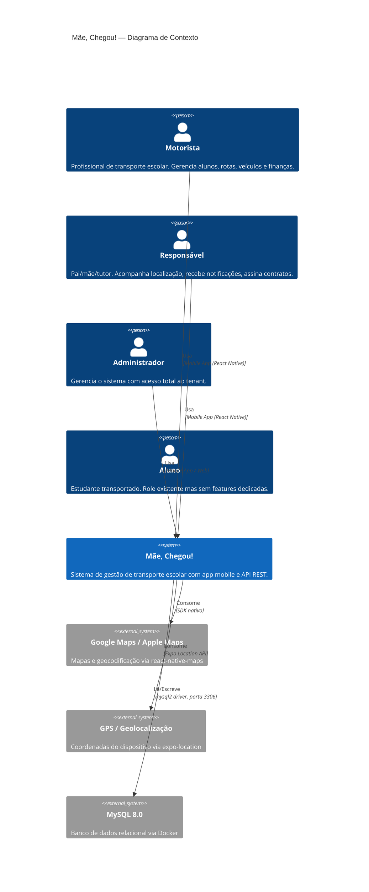
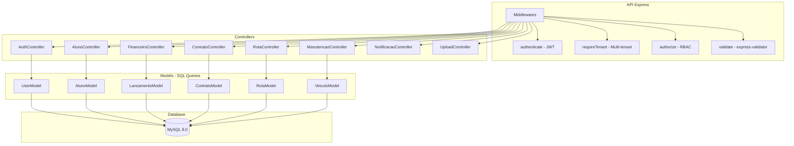
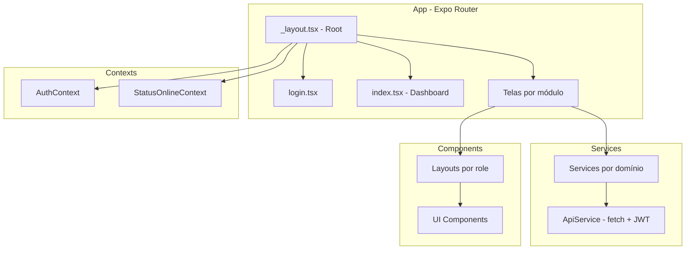
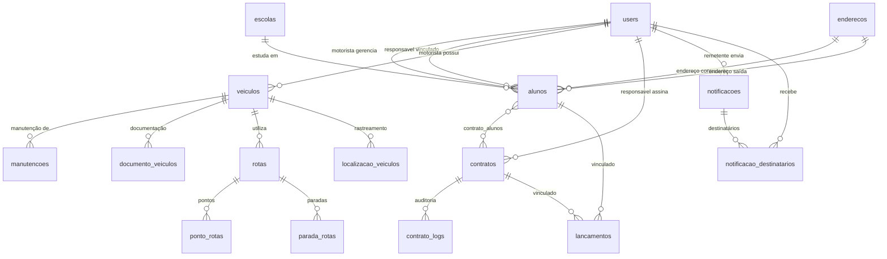

# Arquitetura do Sistema — cheguei_mae

> Gerado pelo **Arquiteto** do Reversa em 2026-05-18
> Nível: **Essencial** | Escala: 🟢 CONFIRMADO | 🟡 INFERIDO | 🔴 LACUNA

---

## 1. Visão Geral

O **Mãe, Chegou!** é um sistema de gestão completa para transporte escolar. Possui arquitetura client-server com:

- **Frontend Mobile** (React Native / Expo) — App mobile-first com suporte web
- **Backend API** (Node.js / Express) — API REST com autenticação JWT
- **Banco de Dados** (MySQL 8.0) — Containerizado via Docker
- **Multi-tenant** — Isolamento de dados por motorista/empresa

## 2. Diagrama C4 — Contexto (Nível 1)



## 3. Containers

| Container | Tecnologia | Responsabilidade | Porta |
|-----------|-----------|------------------|-------|
| **Mobile App** | React Native 0.81 + Expo 54 + TypeScript | Interface do usuário, navegação, cache local (AsyncStorage) | — |
| **API REST** | Node.js + Express 4 + TypeScript | Lógica de negócio, autenticação, validação, queries SQL | `3000` |
| **MySQL** | MySQL 8.0 (Docker) | Persistência relacional, 17 tabelas | `3306` |
| **Disco Local** | Sistema de arquivos do server | Armazenamento de uploads (Multer) | — |

### Comunicação entre containers

```
Mobile App ──HTTP/JSON──▶ API REST ──mysql2──▶ MySQL 8.0
                │                      │
                │                      └──fs──▶ Disco (uploads/)
                │
                └──SDK nativo──▶ Maps / GPS
```

## 4. Componentes Principais

### Backend API



### Frontend Mobile



## 5. ERD Resumido



### Cardinalidades-chave

| Relação | Tipo | Confiança |
|---------|------|-----------|
| User (motorista) → Alunos | 1:N | 🟢 |
| User (responsavel) → Alunos | 1:N | 🟢 |
| Contrato → Alunos | N:M (via `contrato_alunos`) | 🟢 |
| Veículo → Motorista | N:1 | 🟢 |
| Rota → Pontos | 1:N (ordenados) | 🟢 |
| Notificação → Destinatários | 1:N | 🟢 |
| Lançamento → Aluno | N:1 (opcional) | 🟢 |
| Lançamento → Contrato | N:1 (opcional) | 🟢 |

## 6. Integrações Externas

| Integração | Status | Protocolo | Descrição |
|------------|--------|-----------|-----------|
| Google Maps / Apple Maps | 🟢 Configurado | SDK nativo (`react-native-maps`) | Renderização de mapas e marcadores |
| GPS / Geolocalização | 🟢 Configurado | Expo Location API | Coordenadas do dispositivo móvel |
| MySQL 8.0 | 🟢 Configurado | TCP/mysql2 driver | Banco de dados principal |
| Pagamentos (PIX/Boleto) | 🔴 Planejado | — | Listado em "Próximos Passos" do README |
| Push Notifications | 🔴 Planejado | — | Listado em "Próximos Passos" do README |
| Assinatura Digital | 🔴 Planejado | — | Contrato prevê `arquivoUrl` mas sem integração |

## 7. Dívidas Técnicas

| # | Dívida | Severidade | Impacto |
|---|--------|-----------|---------|
| DT-01 | **Sem testes automatizados** — nenhum framework de teste configurado | 🔴 Crítica | Todo o sistema sem rede de segurança |
| DT-02 | **Senha temporária não hasheada** — responsáveis criados inline recebem `temp_password` em texto puro | 🔴 Crítica | Vulnerabilidade de segurança |
| DT-03 | **Register público sem restrição de role** — qualquer um pode criar admin | 🔴 Crítica | Vulnerabilidade de segurança |
| DT-04 | **Chat sem backend** — tela existe mas sem API | 🟡 Alta | Feature não funcional |
| DT-05 | **Recorrência financeira não materializada** — metadado armazenado mas sem job/cron | 🟡 Alta | Lançamentos recorrentes precisam criação manual |
| DT-06 | **Sem job para atualizar status de vencimento** — lançamentos e manutenções atrasadas não são marcadas automaticamente | 🟡 Alta | Dados de inadimplência imprecisos |
| DT-07 | **Scheduler de notificações ausente** — notificações agendadas nunca são enviadas | 🟡 Alta | Feature parcialmente não funcional |
| DT-08 | **Sem validação de transição de estado** — contratos e rotas aceitam transições inválidas | 🟡 Média | Dados inconsistentes possíveis |
| DT-09 | **@types em dependencies** — devDeps incorretamente em dependencies no backend | 🟢 Baixa | Não afeta funcionamento |
| DT-10 | **Escola criada com cidade/estado hardcoded** — "São Paulo/SP" fixo | 🟡 Média | Dados incorretos fora de SP |
| DT-11 | **Email único global** — ao invés de por tenant | 🟡 Média | Conflito de emails entre tenants |
