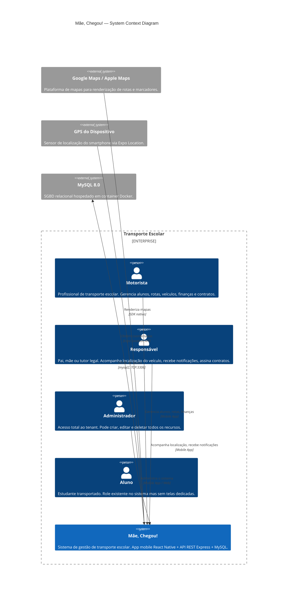

# Diagrama C4 — Contexto (Nível 1) — cheguei_mae

> Gerado pelo **Arquiteto** do Reversa em 2026-05-18

---

## Diagrama

## Atores e Responsabilidades

| Ator | Ações Principais | Canal |
|------|------------------|-------|
| **Motorista** | Cadastrar alunos, criar rotas, registrar finanças, enviar notificações, gerenciar veículos e manutenções | App Mobile (React Native) |
| **Responsável** | Visualizar dados dos filhos, rastrear motorista em tempo real, receber notificações, assinar contratos | App Mobile (React Native) |
| **Admin** | Acesso total: criar/editar/deletar qualquer recurso do tenant | App Mobile / Web |
| **Aluno** | 🔴 Sem funcionalidades implementadas | — |

## Sistemas Externos

| Sistema | Tipo de Integração | Status |
|---------|-------------------|--------|
| Google Maps / Apple Maps | SDK nativo via `react-native-maps` | 🟢 Implementado |
| GPS do Dispositivo | `expo-location` (permissão `ACCESS_FINE_LOCATION`) | 🟢 Implementado |
| MySQL 8.0 | Driver `mysql2` via TCP (porta 3306) | 🟢 Implementado |
| Gateway de Pagamento | 🔴 Não implementado | Planejado (PIX, boleto) |
| Push Notifications | 🔴 Não implementado | Planejado |
