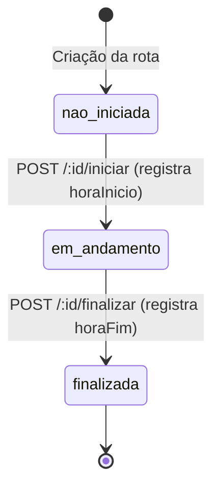
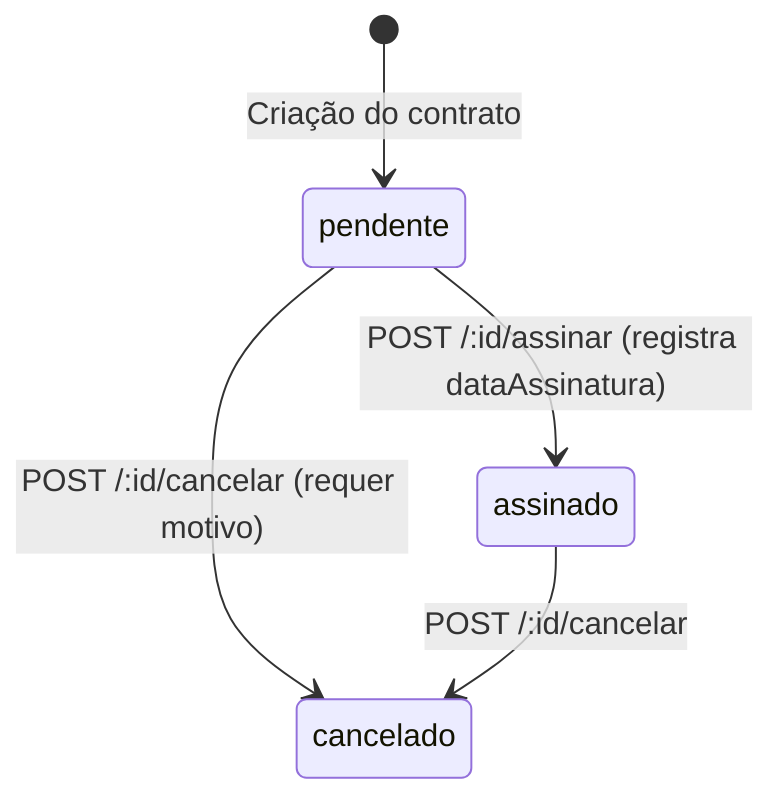
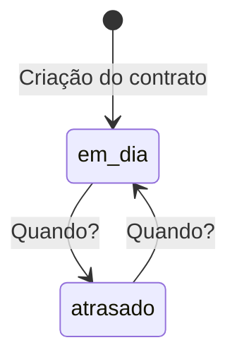
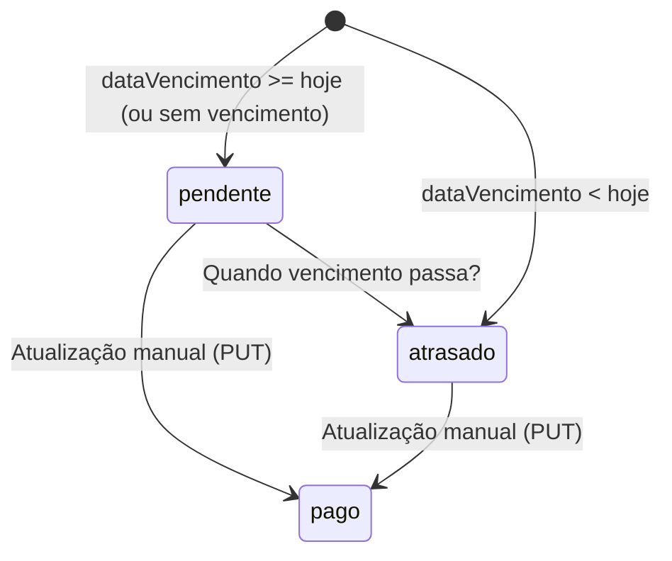
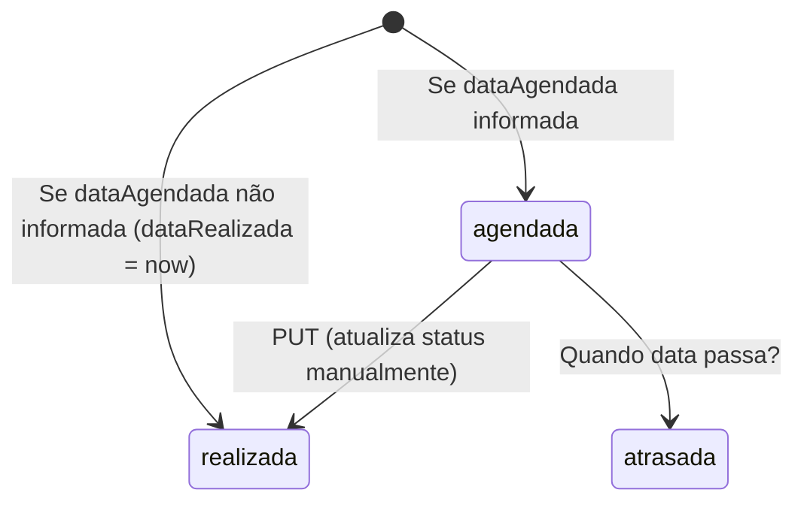
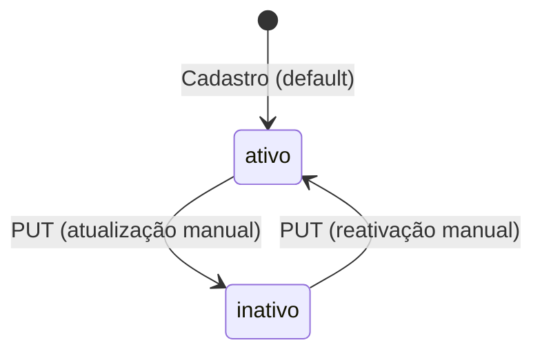
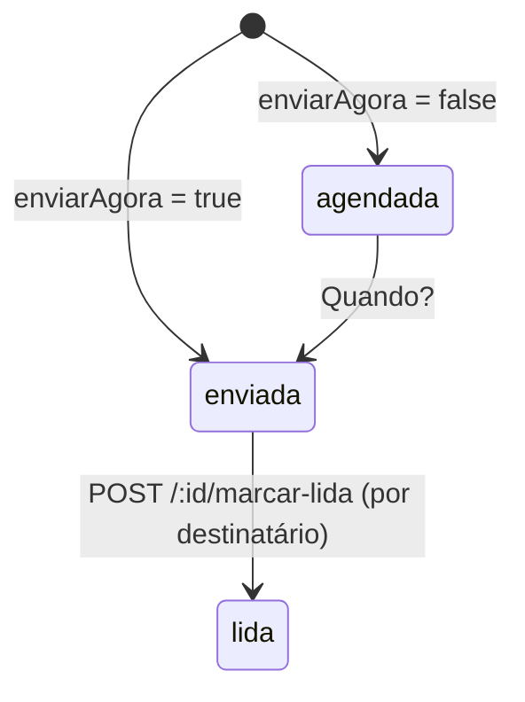

# Máquinas de Estado — cheguei_mae

> Gerado pelo **Detetive** do Reversa em 2026-05-18
> Escala: 🟢 CONFIRMADO | 🟡 INFERIDO | 🔴 LACUNA

---

## 1. Rota — `StatusRota`

Valores: `nao_iniciada` | `em_andamento` | `finalizada`

| Transição | Gatilho | Efeito | Confiança |
|-----------|---------|--------|-----------|
| `[*] → nao_iniciada` | `POST /api/rotas` | Rota criada com pontos | 🟢 |
| `nao_iniciada → em_andamento` | `POST /api/rotas/:id/iniciar` | `horaInicio = now` | 🟢 |
| `em_andamento → finalizada` | `POST /api/rotas/:id/finalizar` | `horaFim = now` | 🟢 |

🟡 **Nota:** Não há validação de transição inválida (ex: `finalizada → em_andamento`). O status é atualizado diretamente sem verificar o estado anterior.

---

## 2. Contrato — `statusAssinatura`

Valores: `pendente` | `assinado` | `cancelado`

| Transição | Gatilho | Efeito | Confiança |
|-----------|---------|--------|-----------|
| `[*] → pendente` | `POST /api/contratos` | Número CT-ANO-SEQ, log `criado` | 🟢 |
| `pendente → assinado` | `POST /api/contratos/:id/assinar` | `dataAssinatura = now`, log `assinado` | 🟢 |
| `pendente → cancelado` | `POST /api/contratos/:id/cancelar` | log `cancelado` com motivo | 🟢 |
| `assinado → cancelado` | `POST /api/contratos/:id/cancelar` | 🟡 Código permite mas não é validado | 🟡 |

🟡 **Nota:** Não há guard que impeça cancelar um contrato já assinado. O log `cancelado` é sempre criado.

---

## 3. Contrato — `statusPagamento`

Valores: `em_dia` | `atrasado`

🔴 **LACUNA:** Não há lógica implementada para transicionar entre `em_dia` e `atrasado`. O contrato é sempre criado com `statusPagamento = 'em_dia'` e nunca é atualizado automaticamente.

---

## 4. Lançamento — `LancamentoStatus`

Valores: `pago` | `pendente` | `atrasado`

| Transição | Gatilho | Efeito | Confiança |
|-----------|---------|--------|-----------|
| `[*] → pendente` | `POST /api/financeiro/lancamentos` | Auto-cálculo na criação | 🟢 |
| `[*] → atrasado` | `POST /api/financeiro/lancamentos` | Auto-cálculo na criação | 🟢 |
| `pendente/atrasado → pago` | `PUT /api/financeiro/lancamentos/:id` | Atualização manual | 🟢 |
| `pendente → atrasado` | Job/cron? | 🔴 NÃO implementado — lançamento que vence não muda automaticamente | 🔴 |

---

## 5. Manutenção — `ManutencaoStatus`

Valores: `agendada` | `realizada` | `atrasada`

| Transição | Gatilho | Efeito | Confiança |
|-----------|---------|--------|-----------|
| `[*] → agendada` | `POST /api/manutencoes` com `dataAgendada` | Status automático | 🟢 |
| `[*] → realizada` | `POST /api/manutencoes` sem `dataAgendada` | `dataRealizada = now` | 🟢 |
| `agendada → realizada` | `PUT /api/manutencoes/:id` | Manual | 🟢 |
| `agendada → atrasada` | Cron/scheduler? | 🔴 NÃO implementado | 🔴 |

---

## 6. Aluno — `StatusAluno`

Valores: `ativo` | `inativo`

🟢 Simples e funcional. Motorista só vê alunos `ativo`.

---

## 7. Notificação — `NotificacaoStatus`

Valores: `agendada` | `enviada` | `lida` | `cancelada`

| Transição | Gatilho | Efeito | Confiança |
|-----------|---------|--------|-----------|
| `[*] → enviada` | `enviarAgora = true` | Status definido na criação | 🟢 |
| `[*] → agendada` | `enviarAgora = false` | Status definido na criação | 🟢 |
| `agendada → enviada` | Scheduler/cron? | 🔴 NÃO implementado | 🔴 |
| `enviada → lida` | `POST /:id/marcar-lida` | Atualiza `notificacao_destinatarios` (por destinatário, não a notificação principal) | 🟢 |

🟡 **Nota:** `lida` é um status do **destinatário**, não da notificação em si. A notificação principal mantém status `enviada`. O status `cancelada` existe no tipo mas sem implementação.

---

## Resumo de Lacunas em Máquinas de Estado

| Entidade | Lacuna | Severidade |
|----------|--------|-----------|
| Rota | Sem validação de transição inválida | Média |
| Contrato (assinatura) | Permite cancelar contrato assinado | Média |
| Contrato (pagamento) | Sem lógica de atualização automática | Alta |
| Lançamento | Sem job para marcar vencidos como atrasados | Alta |
| Manutenção | Sem job para marcar agendadas atrasadas | Média |
| Notificação | Sem scheduler para enviar agendadas | Alta |
